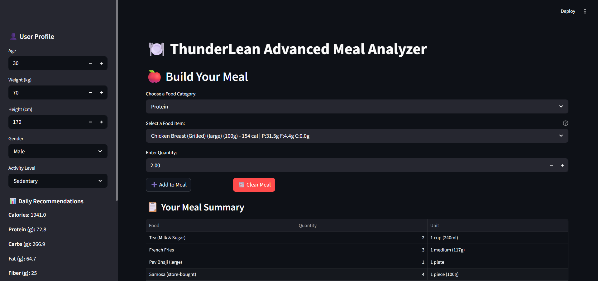
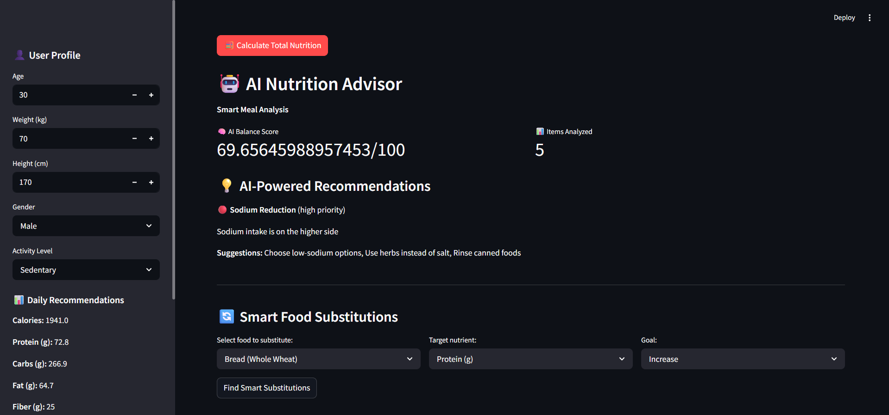
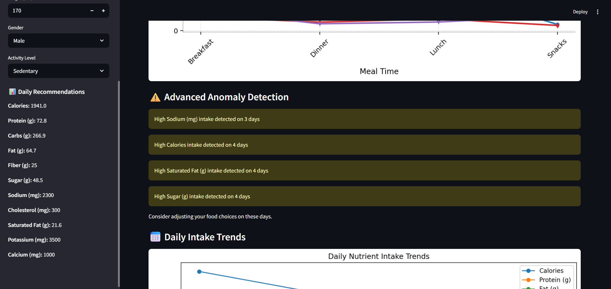
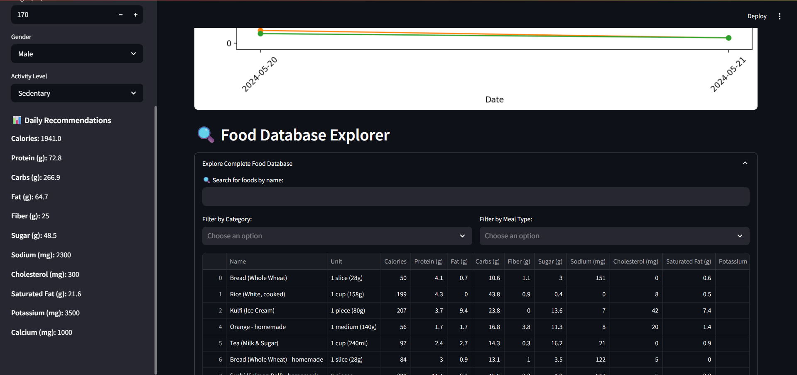

# Streamlit Analytics Dashboard


This folder contains the **Streamlit Analytics Dashboard**, part of the ThunderLean repository. It provides interactive visualization and analytics for datasets using Python, Pandas, NumPy, and Streamlit.

---

## 🚀 Project Overview
The Streamlit Analytics Dashboard allows users to:
- Load and explore datasets interactively.
- Generate dynamic charts, graphs, and tables.
- Filter and aggregate data in real-time.
- Perform basic statistical analysis on the dataset.
- Export insights and summaries for reporting.

**Technologies used:**
- **Python 3.11**
- **Streamlit** – for building interactive dashboards
- **Pandas & NumPy** – for data processing and manipulation
- **Matplotlib & Seaborn** – for plotting visualizations
- **Git & GitHub** – version control and collaboration

---

## 🗂 Folder Structure
```
streamlit-analytics/
│
├── app.py # Main Streamlit application
├── food_database.csv
├── sample_meal_history.csv
├── food_database.txt
├── calorie_calculator.py
├── ai_nutrition_advisor.py
├── requirements.txt
└── README.md # Project documentation
├── screenshots/ # Folder containing dashboard screenshots

```

---

## 📸 Screenshots






---

### 📝 Usage
- Upload your dataset in CSV format.
- Use sidebar filters to explore data dynamically.
- Visualize trends with graphs and charts.
- Export processed data or insights using the provided options.

### 🤝 Contribution
If you find this project helpful, feel free to:
- Fork the repository.
- Submit issues or pull requests.

- Suggest improvements or report bugs.

